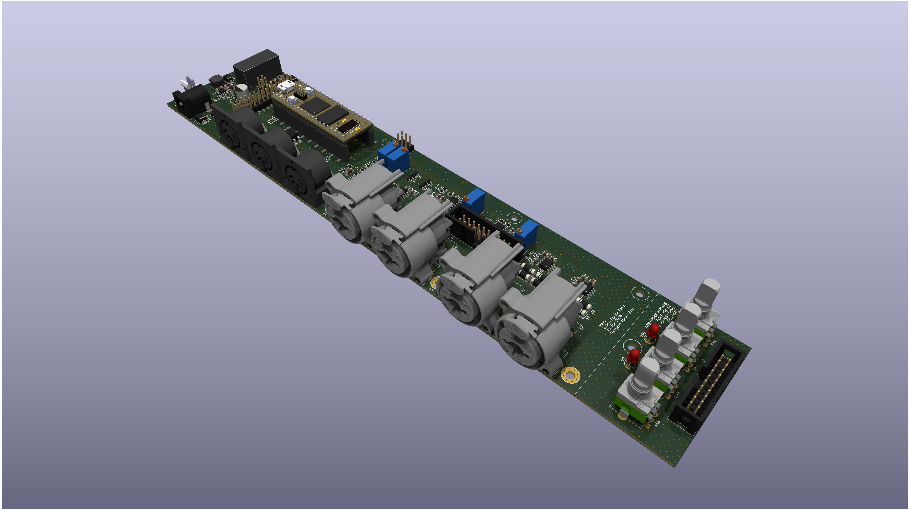
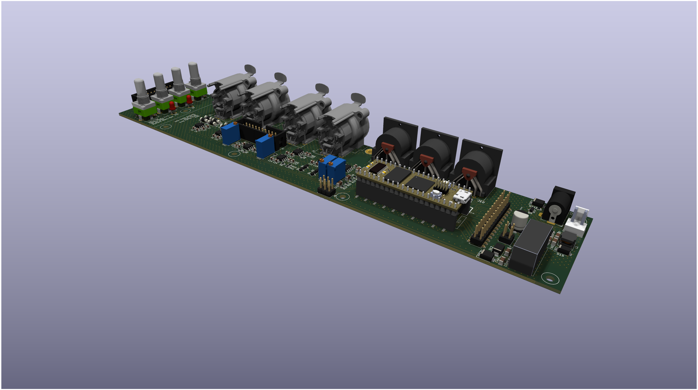

# Daisy Studio - [Website](https://squeedee.github.io/daisy-studio/)

| Front | Back |
|-------|------|
|  |  |

A development board for the [Electrosmith Daisy Seed](https://www.electro-smith.com/daisy/daisy)
DSP module, providing professional studio-grade balanced line input and output.

Schematic PDF: [docs/Daisy Studio Rev2.pdf](docs/Daisy%20Studio%20Rev2.pdf)

THD measurement report (Board 1, loopback, post-F9 retrim — ≤ −88 dB / ≤ 0.004 % @ 1 kHz):
[docs/Daisy THD Meter.pdf](docs/Daisy%20THD%20Meter.pdf)

The board is designed as a **flexible development board** to prototype designs
for:

* synthesizers, desktop, rackmount or with keybeds.
* effects modules, desktop or rackmount.

The main PCB carries all active circuitry and connects to a passive **daughterboard**
that holds the user-facing controls (level pots, clip LEDs).

The designer can replace the daughterboard with controls connected however they desire.

## Features

- **Balanced audio I/O** using THAT Corporation ICs:
    - 2× THAT1246 balanced line receivers (stereo input).
    - 2× THAT1646 balanced line drivers (stereo output).
- **OPA1656 gain stages** on input and output, calibrated for +24 dBu
  peak studio levels.
- **BJT input clamp** with an LM2903 comparator clip indicator —
  protects the Seed's PCM3060 ADC against overdrive and provides user's with professional gain stage control.
- **Neutrik combo jacks** (NCJ6FA-H-0) on all four audio connectors —
  accept both XLR and 1/4" TRS
- **MIDI** in, out, and thru via 5-pin DIN connectors with optoisolated input.
- **Micro SD card** slot.
- **Daughterboard header** (2×10 IDC, ribbon or stack-mount) for
  user-facing gain controls and input clip LEDs.
- **Seed GPIO breakout** header (2×14) for user expansion
- **Analog power** header (2x3) provides +-12v rails for additional analog circuits.
- **Panel power switch** header (JST VH) — ships with a shunt by default,
  swap for a switch harness when wanted.
- **Isolated Chassis Ground** jumper JP1 allows chassis ground to be kept separate 
  from signal grounds. Mounting posts (H1, H4 and H7) share the chassis ground/shield 
  of the Neutrik connectors.

## Circuit Function

### Audio Input

```
Balanced in → THAT1246 → OPA1656 (fixed gain) → daughterboard pot
                                                       ↓
   Daisy Seed ← C_aa anti-alias ← BJT clamp ← R_out (3.3 kΩ) ←
```

The **THAT1246** balanced receiver converts the differential XLR input
to single-ended at −6 dB, keeping +24 dBu peaks within the ±10 V output
swing of the ±12 V rails. Its **Sense pin (5)** is brought back as a
separate trace to the OPA1656 inverting node — Kelvin-connected past
the input resistor — so the THAT1246's internal feedback amp absorbs
any voltage drop across `R_in`, eliminating it as a gain-error term.

The **OPA1656** runs as an inverting amplifier at a **fixed gain of
1.2×** (R_fb = 12 kΩ, R_in = 10 kΩ). At +24 dBu peak input the op-amp
output reaches ±10.45 V, ~550 mV from the ±11 V clip rails. Fixed gain
(rather than a pot in the feedback path) keeps loop phase margin
constant across user level adjustments, and the high-impedance summing
junction stays entirely on the main PCB.

User level is set by a **10 kΩ log pot on the daughterboard**, wired
as a passive three-terminal voltage divider downstream of the op-amp.
Both header legs are low-impedance: the op-amp drives the CW terminal,
and the pot wiper returns to the main PCB into `R_out` (3.3 kΩ) which
caps fault current into the clamp under pathological overdrive.

The **BJT clamp** is the design's centrepiece. A complementary pair
(2N3906 PNP + 2N3904 NPN) per channel clamps the Seed input pin against
±1.565 V references derived from the ±12 V rails by 10 kΩ / 1.5 kΩ
dividers and held stiff at audio frequencies by 47 µF MLCCs. The
transistors' β ≈ 200 means only Ic / β flows through the reference
divider base connection, so the references stay nearly stationary even
under sustained overdrive — the "reference pumping" failure mode that
limits passive diode clamps. The sharp emitter-base knee (NF ≈ 1.24,
versus ~1.82 for diodes) lets the clean signal use the full ADC range
with no distortion. Simulations across five tolerance corners shows
worst-case codec voltage of 4.64 V under +24 dBu pathological overdrive
— 164 mV margin to the PCM3060's 4.8 V damage ceiling.

A **1 nF C0G capacitor** at the Seed input pin, after the clamp, forms
a single-pole LPF with `R_out` plus the pot wiper source impedance.
The corner stays between 27 kHz (pot mid) and 48 kHz (pot ends), well
above the audio band, attenuating wideband op-amp noise and out-of-band
content before it reaches the PCM3060's sigma-delta ADC.

A **clip indicator** uses an LM2903 comparator monitoring the Seed
input against an adjustable threshold. A trim pot on the daughterboard
(0 V to +1.565 V) sets the threshold; the open-collector output sinks
an LED current path against +12 V through a 1 kΩ limit on the main PCB.
At audio frequencies the LED flickers faster than the eye sees — a dim
glow at light clipping, bright at heavy. A single LM2903 covers both
channels.

### MIDI

Standard MIDI 1.0 — a 5 mA current loop at 31.25 kbaud on three
SDS-50J DIN-5 jacks (IN, OUT, THRU).

```
DIN-5 IN ── 220R × 2 ── 1N4148W ── H11L1SM (opto, Schmitt)
                                       ├── 270R pull-up to +3V3D
                                       ├── → MIDI_RX → Seed UART RX
                                       └── 33R × 2 → DIN-5 THRU

Seed UART TX ── MIDI_TX ── 33R + 10R ── DIN-5 OUT
```

The H11L1SM Schmitt-trigger optocoupler galvanically isolates the input
per the MIDI 1.0 electrical spec and presents clean UART edges to the
Seed. THRU buffers the same opto output through a second pair of 33 Ω
series resistors. OUT is driven directly from the Seed UART TX through
a 33 Ω + 10 Ω series pair.

### Audio Output

```
Seed audio → OPA1656 (gain ~9.1×, C_fb LPF) → daughterboard pot
                                                       ↓
        XLR ← SM4004 phantom clamps ← THAT1646 balanced driver ←
```

The Seed's PCM3060 outputs ~2 V p-p at digital full scale (~−1 dBu
single-ended, ~+5 dBu differential through the THAT1646 alone). An
OPA1656 inverting gain stage closes the ~20 dB gap to the +24 dBu
studio peak target. R_in is a fixed 2.2 kΩ; R_fb is **15 kΩ fixed in
series with a 10 kΩ multi-turn cermet trimmer** (e.g. Bourns
3296W-1-103). Mid-trim lands at gain ~9.1× (+23.7 dBu peak); the
25-turn trim resolves to ~0.5% of R_fb. The fixed floor prevents
accidental hard clipping if the wiper loses contact, and the ceiling
(R_fb ≤ 25 kΩ) stays below the OPA1656's onset of clipping.

A **100 pF C0G across R_fb** turns the gain stage into a single-pole
LPF with f_c ≈ 80 kHz at nominal trim. The Seed Rev 7's PCM3060 has
out-of-band delta-sigma noise that the codec's internal RC alone does
not adequately attenuate; the in-feedback-loop LPF handles this
without adding any series parts. C0G dielectric is required —
X5R/X7R have voltage-coefficient distortion that would intrude into
the audio band when the cap is in the feedback path. Sim shows
−0.27 dB at 20 kHz, −22 dB at 1 MHz.

User output level is a **10 kΩ log pot per channel on the
daughterboard**, voltage-divider-wired downstream of the op-amp. Two
separate pots (not ganged) let users pick their own taper or matching
strategy. The THAT1646's high-Z input means the op-amp sees a constant
10 kΩ load regardless of wiper position.

The **THAT1646** balanced driver converts the single-ended pot wiper
back to a differential XLR pair. Sense pins close the feedback loop at
the XLR connector for cross-coupled output impedance and immunity to
load imbalance.

**Phantom-power protection**: four SM4004 diodes per channel (two per
XLR pin) clamp the THAT1646 output to the ±12 V rails. If an XLR is
plugged into a phantom-enabled mic preamp, +48 V through the preamp's
6.8 kΩ feed produces ~5 mA per pin into the clamp — well within the
SM4004's 1 A rating.

**Rail protection** (phantom back-feed when the gear is powered off):
one SMBJ15CA bidirectional TVS on each ±12 V rail to AGND, placed near
the RS3-1212D output. Same part as the input over-voltage TVS for BOM
consolidation. Clamps when the rail magnitude exceeds ~16 V.

### Daughterboard Architecture

The main PCB commits to a **2×10 (20-pin) 2.54 mm pitch through-hole
footprint** for the daughterboard header. Daughterboard PCBs are
**fully passive**, populating only:

- 2× input level pots (10 kΩ log)
- 2× output level pots (10 kΩ log)
- 2× clip LEDs

No ICs, no power rails, and no high-impedance feedback nodes cross the
header — shorting any two daughterboard signals together cannot damage
the main PCB. The 18 needed signal pins fit in the 20-pin footprint
with two AGND pins at the bottom; AGND is interleaved on every audio
pair.

The same footprint supports two build modes:

- **Cable-mount**: a shrouded IDC header (e.g. Samtec
  TSS-110-01-G-D) on the main PCB, 20-way IDC ribbon to a matching
  socket, or a soldered header (lower profile) on the daughterboard.
  Cable length ≤ 150 mm comfortable.
- **Pins and Shielded pairs**: Alternatively pins and shielded wire pairs
  can run longer distances.
- **Stack-mount (default)**: Samtec flex-stacking posts; the daughterboard sits
  directly above the main PCB at a chosen height, no cable.

Pinout (canonical):

| Pin | Signal       | Pin | Signal       |
|----:|--------------|----:|--------------|
|   1 | AGND         |   2 | AGND         |
|   3 | IN_OPA_L     |   4 | IN_OPA_R     |
|   5 | IN_WIPER_L   |   6 | IN_WIPER_R   |
|   7 | AGND         |   8 | AGND         |
|   9 | OUT_OPA_L    |  10 | OUT_OPA_R    |
|  11 | OUT_WIPER_L  |  12 | OUT_WIPER_R  |
|  13 | AGND         |  14 | AGND         |
|  15 | CLIP_LED_A_L |  16 | CLIP_LED_A_R |
|  17 | CLIP_LED_K_L |  18 | CLIP_LED_K_R |
|  19 | AGND         |  20 | AGND         |

The moderate-Z `IN_WIPER_*` pair and the fast-edge `CLIP_LED_K_*` pair
(LM2903 open-collector) sit at opposite ends of the header to limit
capacitive crosstalk on a ribbon. User extensions that need active
circuitry use the GPIO breakout header instead.

### Seed GPIO Breakout

A **2×14 (28-pin) 2.54 mm vertical pin header** brings out every Seed
GPIO not committed to the on-board audio (ADC/DAC), MIDI (UART_RX/TX),
or USB (D+/D−, VBUS) — plus +5 V, +3V3D, and DGND for downstream
circuits. Pin-to-net assignment is slightly illogical, as they were selected
to minimise via count and trace crossings between the Seed and the
breakout.

Analog ±12 V rails are not on the breakout (or on the daughterboard
header); they distribute through the dedicated power header.

### Power

```
12 V barrel jack → SW1 (panel switch / shunt) → DMP3056L (rev-polarity)
                                                       ↓
                                              SMBJ15CA TVS (overvoltage)
                                                       ↓
                                                100 µF bulk → +12V_RAW
                                                       ├─→ TPS54302 → +5V
                                                       └─→ RS3-1212D → ±12V
```

A 12 V wall-wart feeds a 2.1 mm barrel jack. **SW1** — a JST B2P-VH
2-pin THT header in series after the jack — takes either a pre-crimped
shunt harness (default, bypasses the switch) or an external panel
switch harness (VHR-2N housing, SVH-21T-P1.1 contacts). Placing the
switch *before* reverse-polarity protection means rev-pol and TVS
clamping still function during a miswired wall-wart event regardless
of switch state.

Reverse polarity is blocked by a **DMP3056L-13** P-FET (VGS_max ±20 V,
RDS_on ~51 mΩ) — sized for the −12 V on the gate that this
configuration imposes when input is correct. An **SMBJ15CA**
bidirectional TVS clamps any over-voltage spike from a misbehaved
supply. A 100 µF / 25 V electrolytic provides bulk on +12V_RAW.

The **TPS54302 buck** (SOT-23-6) generates +5 V from +12V_RAW for the
Daisy Seed and the MIDI front-end. Feedback divider 100 kΩ / 13.3 kΩ
sets Vout ≈ 5.07 V; inductor L3 = 10 µH (Bourns SRN6045TA). Output
caps are 2× 22 µF / 25 V X7R 1206 (5× voltage derating). A dedicated
**10 µF / 25 V X7R 1206** input MLCC sits at the VIN pin to handle the
buck's pulsed input current at 500 kHz with low loop inductance — the
part the TPS54302 datasheet calls for. A defensive **SMAJ5.0A** TVS
clamps +5 V to GND near the Seed.

The **Recom RS3-1212D** isolated DC/DC (SIP-8, 3 W, regulated ±2%,
±125 mA per rail) generates the ±12 V analog rails. The output passes
through 2× BLM18PG121SN1 ferrite beads into the rest of the board.

Power budget (±12 V rails):

| Consumer                       | +12V mA | −12V mA |
|--------------------------------|--------:|--------:|
| 2× THAT1246 (input receivers)  |    16.0 |    16.0 |
| 2× THAT1646 (output drivers)   |    18.0 |    18.0 |
| 1× OPA1656 (input gain, dual)  |     7.8 |     7.8 |
| 1× OPA1656 (output gain, dual) |     7.8 |     7.8 |
| BJT clamp reference dividers   |     2.1 |     2.1 |
| LM2903 quiescent               |     0.5 |     0.5 |
| **Total**                      | **~52** | **~52** |

≈ 1.25 W output power against the RS3-1212D's 3 W rating — ~2.4×
headroom, defensive margin against component tolerance and operating
temperature; margin for user consumption on the power header will be
validated and provided as a spec (once the boards are tested)

**Grounding**: AGND and DGND meet near the Seed's pin 20 (AGND) in a two
layer connection between AGND and DGND isolated planes.

AGND and CHASSIS meet only at JP1 (a solder jumper on the underside of the board)
Users can isolate the chassis ground of the Neutrik connectors by cutting this
jumper. Chassis Ground connects to all three mounting holes left, center and right
of the Neutrik connectors.

## Project Structure

Designed in KiCad 8 with a hierarchical schematic:

- `daisy-studio.kicad_sch` — root sheet
- `audio_input.kicad_sch` — input section (THAT1246, OPA1656, BJT clamp, LM2903)
- `audio_output.kicad_sch` — output section (OPA1656, THAT1646, phantom protection)
- `daisy_seed.kicad_sch` — Seed module + MIDI front-end + GPIO breakout
- `power.kicad_sch` — power section (buck + isolated DC/DC + protection)
- `daughter.kicad_sch` — passive daughterboard (separate fab)
- `misc.kicad_sch` — daughterboard header and mounting parts for the main board.

LTspice simulations validating the input-stage clamp / signal path and
the output reconstruction LPF live under `sim/input/` and `sim/output/`.

## Status

Rev 2 — fab sent.
